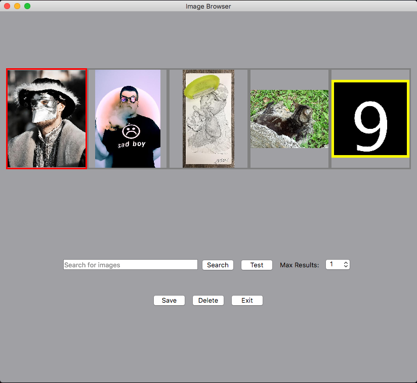
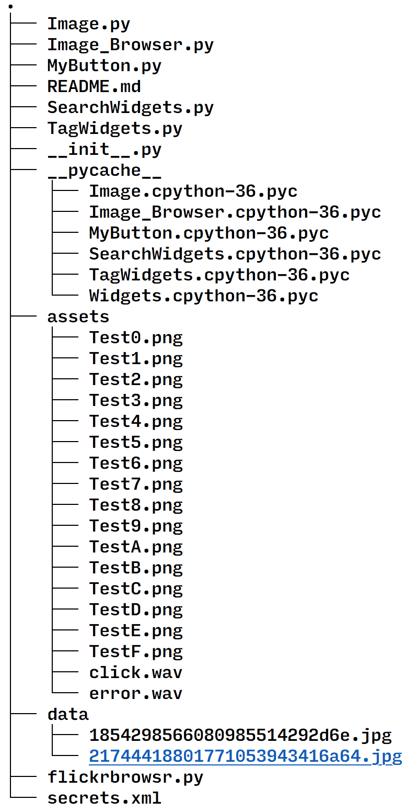

# FlickrBrowsr

#### A Cross-Platform Image Application Built with PyQt5

FlickrBrowsr is a proof-of-concept application which allows users to search the Flickr platform for images, add tags to images, and save the tagged images to their local library. It uses the Python Qt SDK wrapper **PyQt5** for all GUI and multimedia management and the `flickrapi` python module to interact with Flickr.

### Requirements

This project requires the `pyqt5` and `flickrapi` python modules and their dependencies, including `requests` and `six`. 

### Known Issues

Although this project was intended to have complete cross-platform support, incompatibility between Qt, OpenSSL, and Linux proved too troublesome to support Linux as a platform. In fact, this program will hardly run at all without a valid Flickr API key (not included), regardless of your platform. 

### Program Structure

The overall structure of this program is:

`flickrbrowsr.py` is the entry point, which creates the main ImageBrowser window. 

This ImageBrowser (model, view, and controller) switches between two views, the Search View and Tag View. 

Each of these two views is composed of a number of widgets, which handle being clicked or otherwise interacted with by making changes to themselves or requesting other changes be made to the ImageBrowser model. 

That's basically it. There's some room for improvement in adherence to the MVC model, but this is sufficient for this proof of concept for now. 

`tree` output:

From the top down:

**Image.py** is a custom class which inherits from QLabel.

* `borderColorActive`, `borderColorInactive`, `styleString`: Class attributes for styling all images
* `file_path`, `qimage`, `pixmap`: the local path of this image, qimage and qpixmap for on- and offscreen image manipulation
* `activate()`: sets pixmap's styleSheet to active
* `addTag(tag)`: adds tag to qimage's text as a value with key "PyQtBrowserTags"
* `deactivate()`: Sets pixmap's stylesheet to inactive
* `delete()`: Deletes this image file from the user's library
* `saveTags()`: Saves this image to the user's library if it has any tags. 
* `save()`:  Saves this image to the user's library whether or not it has tags. 

**Image.py** also contains the two subclasses **Thumbnail** and **ZoomedImage**, which primarily exist to allow images to be more easily resized depending on the manner in which they are viewed. This inheritance model is central to the implementation of the rest of the program, but makes implementing clickable Images unnecessarily difficult. It would be worth exploring an alternative implementation wherein Thumbnails and ZoomedImages are attributes of Images, rather than subclasses are them. 

* `resizeToParent()`: This function calculates the new size of an Image's pixmap, depending on the size of its parent widget. There is a known issue with this function, in that it does not always correctly resize Thumbnails. See Known Issues section for more information.  

**Image_Browser.py** is the main program window, a QStackedWidget. Using QStackedWidget allows for easy switching between the Search or Tagging views of this application. 

* `selected_image_index`, `images`: List of images in memory and which image is currently selected. These attributes are referred to by various other classes throughout the program. 
* `netman`: a QNetworkAccessManager which handles asynchronous requests to the Flickr API. 
* `max_thumbnails`: The largest number of thumbnails which should be displayed on screen at one time. Currently hardcoded, should probably be read from a config file. 
* `search_view`, `tag_view`: The full-window views of this application, displayed while searching for or tagging images. Added and reparented to the StackedWidget at initialization and switched between
* `keyPressEvent(event)`: handles keyboard input
* `zoomIn()`, `zoomOut()`: Change views accordingly
* `setSelectedImageIndex(index)`: Does what it says, checks the number of images in the application to prevent IndexErrors or logic errors
* `currentImage()`: Returns the currently selected image, or None if there are no images
* `handleDelete()`: Deletes the selected image, broadcasts update to child widgets. 
* `selectNextImage()`, `selectPreviousImage()`, `selectNextPage()`, `selectPreviousPage()`: set selected image index as appropriate, broadcasts update to child widgets. 
* `addTag(tag)`, `saveAllTags()`: provide an interface for TagWidget to add/save tags to images maintained by ImageBrowser
* `search(terms, max_results)`: requests xml data for *max_results* photos with tags *terms* from the flickr api. Parses returned xml data into each photo's URL, which is then asynchronously requested by `netman`. 
* `requestFinished(reply)`: When a request finishes it calls this handler function which checks for HTTP errors, parses out the requested image URL, reads the image data, and adds the image to the browser. 

**MyButton.py** is a small class which simply sets defaults for buttons in this project. 

**SearchWidgets.py** contains QWidgets and associated functions searching and displaying thumbnails of images. 

* `main_layout`: a QVBoxLayout, to accomodate the multiple rows of widgets
* `thumbnail_container`: Necessary to constrain the height of the thumbnail layout's vertical size
* `searchPanel`: A QWidget which contains various subwidgets and functions necessary for searching the Flickr API
* `currentImage()` selects the specific thumbnail which is currently active
* `selectNextImage()`, `selectPreviousImage()`: Does what it says, special handling for being called when the first or last thumbnail is already selected
* `loadThumbnails()`: reloads all thumbnails around the currently selected thumbnail. Called when changing pages and in a variety of other circumstances. 

**SearchPanel** is a QWidget which is part of the Search View. It has a Search Field, Search, Save, and Exit buttons, and a Max Results combo box. It has the necessary handler functions for each of these. 

**TagWidgets.py** contains classes for the Zoomed/Tagging view. 

**TagView** is the full-window widget which contains a zoomed image and the necessary buttons to add, save, and display tags. 

* `addTag(tag)`: Asks the image browser to add the tag, adds the tag to the tag list widget. 
* `setImage(image)`: calls child widget setImage() method.
* `update()`: Changes the displayed image and tags
* `updateTags()`: updates only the tags
* `saveAllTags()`: Calls parent function

**TagListWidget**: A QWidget which composes the area of the TagView which displays image tags. Trivial class, not much to say here. 

**TagAddWidget**:  TagAddWidget is a widget composed of a QLineEdit and two buttons which, when clicked, add a tag to the currently selected QImage and displayed list of tags and allow the user to choose to save them. Otherwise trivial class. 

**ZoomedWidget**: The actual QWidget which displays the image a user wants to tag. Fairly small, trivial class. 

**flickrbrowsr.py**: Entry point for the program. 

**secrets.xml**: The lazy way to use an API key without exposing it in a public repository? Add its file to your .gitignore. 

### Challenges and Known Issues

The typical approach when using Qt5 is to create the GUI with QtCreator and/or QML, but there is a notable lack of documentation, examples, or tutorials on how to do this with Python. This is also true of most of the rest of PyQt5, but whereas there is an intuitive approach to using the Qt API in Python by utilizing inheritance and leaps of faith, using Qt Creator with a Python project is much less intuitive. Because of this, development of this project took what seemed to be the only viable course and used QLayouts to create the GUI, which turned out to be, in the words of Dr. Hsu, "error-prone and tedious."  If you're considering using PyQt for GUI work, my advice would be to wait until the Qt developers furnish that approach with some better examples. 

The chosen implementation of Thumbnails and ZoomedImages as subclasses of our Image class makes things like clickable images difficult, and also causes an anti-pattern in that Images are always made to .hide() and subclasses must then .show(). It would probably make more sense to have an Image class which did not subclass QLabel and had QImages, QPixmaps, Thumbnails, and ZoomedImages as attributes, or even a proper sizing method to switch between them instead. This would basically be a rewrite of the project, and is questionably worthwhile at this point. 

Adding a secret to a public GitHub repository proved nontrivial. There are a few tools available for this but none of them have great documentation, and it seemed not strictly necessary considering I'm likely to be the only person to ever run this program, so I skipped it. The program won't function without an API key, so if you try to clone this repo, the program will not run. 

### Conclusion

If I were to do this project again, I would more clearly separate on- and off-screen data representations in the Image class and might even choose to do the entire thing in C++ to more easily create the project with Qt Creator. 
